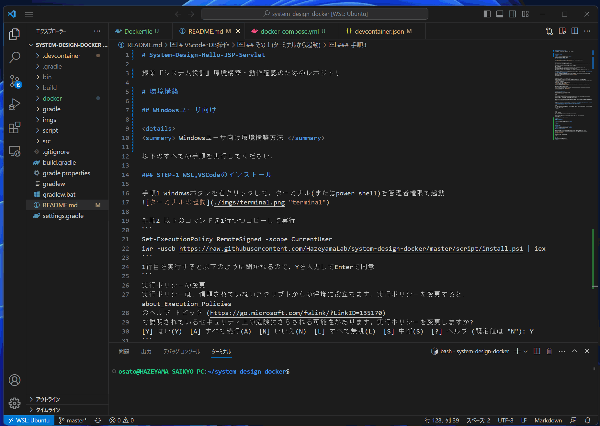
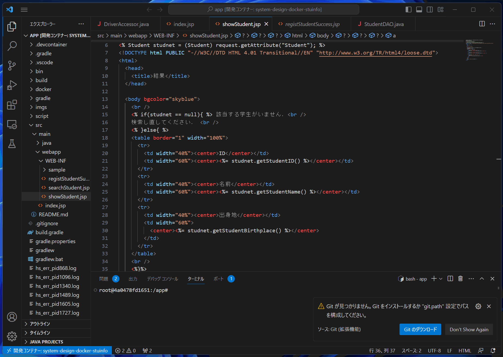
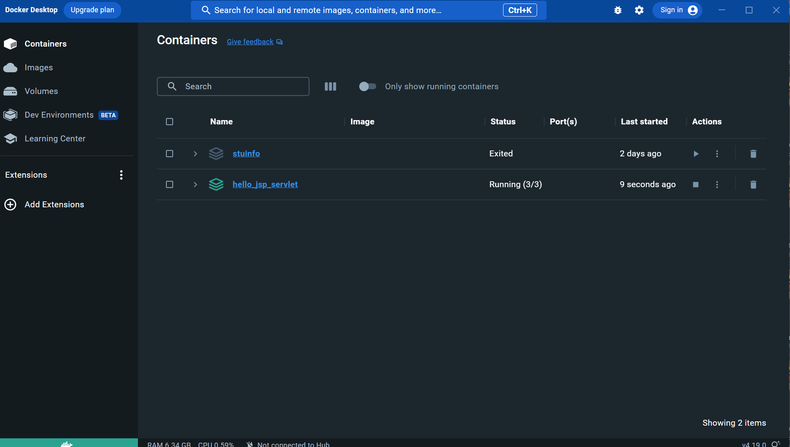
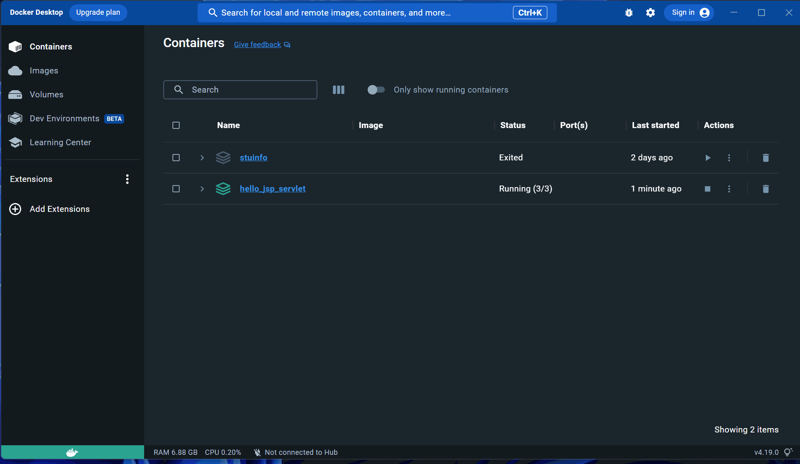

# System-Design-Stuinfo

授業『システム設計』で用いるアプリケーション作成の流れ学習のためのレポジトリ


# VScodeの操作
## 基礎的なVScodeの操作方法
<details>
<summary> VScodeでプロジェクトを開く方法 </summary>

## 初回の設定
初回起動時のみ以下の手順を行う．<br>
Windowsの人はUbuntu, Macの人はターミナルを起動し，以下のコマンドを入力して実行
```sh
git clone https://github.com/HazeyamaLab/system-design-docker-stuinfo.git
```
以上でプロジェクトのクローンが終了するので，あとはVScodeの操作 -> VScodeでプロジェクトを開く方法に従ってプロジェクトを開けばOK


## その１(ターミナルから起動)

### 手順1
Ubuntu(Win)もしくはターミナル(mac)を起動し，以下のコマンドを実行してプロジェクトフォルダに移る
Stuinfoプロジェクトや課題プロジェクトを開く場合はsystem-design-dockerのディレクトリ名部分を適宜修正
|  プロジェクト名  |  ディレクトリ名  |
| ---- | ---- |
|  動作確認  |  system-design-docker  |
|  stuinfo  |  system-design-docker-stuinfo  |
|  課題用テンプレート  |  system-design-docker-your-project  |
```sh
cd system-design-docker
```
### 手順2
以下のコマンドを実行してVScodeを起動
```sh
code .
```

### 手順3
VScodeをdev-containerで再度開く(gif参照)


### 手順4
手順5  
画面下部ターミナルで以下のコマンドを実行．もしターミナルが表示されていなければ，上部メニューバーの ターミナル -> 新しいターミナル で出現する．
```
./gradlew tR
```
  

## その2(こっちのほうが楽です)

VScodeを起動し，ファイル ->  最近使用した項目を開く<br>
[dev container:system-design-docker]等の開きたい項目をクリックするだけ


</details>

<br>

# MySQL
## データベースの操作方法
<details>
<summary> Dockerのデータベースを操作する方法 </summary>

### 前提
VScode を立ち上げて，dev-containerが立ち上がっている状態であること Docker Desktopを起動して下の画像のように，対象のStack(3つ座布団が重なっているようなアイコン)が緑色になっていればOK
  

### 手順1 Docker Desktopを起動する
もしdev-containerが立ち上がっていない場合は，VScodeの操作方法 -> 手順3を実行すること

### 手順2 対象のStackからhogehoge-dbというコンテナを開く
今回システム設計では3つのStack(hello_jsp_servlet / stuinfo / your_project)を配布するので，DB操作を行いたいプロジェクトを選択して， __末尾が-dbとなっているコンテナを選択__ して，Terminalを開く 詳細はGif参照


### 手順3 MySQLを起動する
以下のコマンドをTerminal上で実行
```
mysql -utest -p
```
Enter password:と表示されてパスワード入力が求められるので，test と入力．__パスワードは入力しても画面上に表示されないので要注意！__ <br>
尚，今回用いるDBの基本情報は以下の通り
|    |    |
| ---- | ---- |
|  ユーザ名  |  test  |
|  パスワード  |  test  |
|  DB名  |  db  |

### 手順4 MySQLが立ち上がったら，任意の操作を行う．
以下のコマンドを入力して，データベースを選択した後，任意の操作が行える．
```
use db;
```


</details>